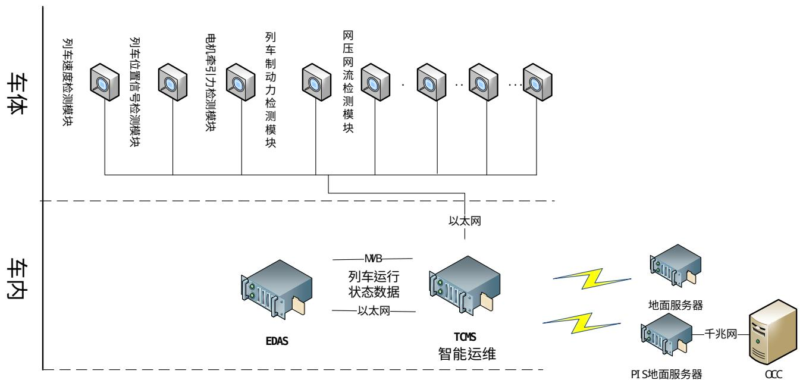

# TCMS与EDAS的MVB协议

项目名称：福州地铁6号线既有车单车节能驾驶试验项目编号：

文档编号： T

版本： A.4

更改历史  

<table><tr><td>版本</td><td>更改人</td><td>日期</td><td>更改内容</td><td>更改章节</td></tr><tr><td>A.2</td><td>莫渺</td><td>2025-07-11</td><td>1、修改EDAS的设备地址；2、0xF1-F4、0xFF长度改为8字节；3、修改双方收发MVB端口地址；4、考虑到0xA0状态数据可能用于控制，端口周期改为128ms；5、0xA0端口数据单位前后统一起来；</td><td></td></tr><tr><td>A.3</td><td>刘强强</td><td>2025-07-14</td><td>1、删除EDAS发送给EGWM数据。</td><td></td></tr><tr><td>A.4</td><td>易顺民</td><td>2025-07-21</td><td>提供3.1.4节EDAS所需数据的MVB端口和偏移量说明，EDAS直接从MVB总线上获取数据。3.1.1节和3.1.3节数据按协议端口和偏移从MVB总线取用即可。</td><td></td></tr><tr><td></td><td></td><td></td><td></td><td></td></tr><tr><td></td><td></td><td></td><td></td><td></td></tr><tr><td></td><td></td><td></td><td></td><td></td></tr><tr><td></td><td></td><td></td><td></td><td></td></tr><tr><td></td><td></td><td></td><td></td><td></td></tr><tr><td></td><td></td><td></td><td></td><td></td></tr><tr><td></td><td></td><td></td><td></td><td></td></tr></table>

(说明：文件第一版为“-”版，在进行版本升级时要按照表格格式填写清楚)

# 目录

1 文件目的 4  
2总线接口 4

2.1 EDAS分布和拓扑 4  
2.2 设备地址分配 4  
2.3端口地址分配 5  
2.4 数据格式 5  
2.5监测信号 5  
3TCN接口数据. 6

3.1 EDAS 获取 EGWM 的数据

4缩写. 10

# 1 文件目的

本文档用作福州地铁6号线东调项目网络控制系统与EDAS节能驾驶装置的TCN接口数据描述。

# 2 总线接口

# 2.1 EDAS分布和拓扑

EDAS分布和拓扑下图所示：

# 2.2 设备地址分配

EDAS的设备地址分配如下表：

<table><tr><td>设备名称</td><td>设备地址</td><td>分布车辆</td></tr><tr><td>EDAS1</td><td>0xA1</td><td>Tmc1</td></tr><tr><td>EDAS2</td><td>0xA4</td><td>Tmc2</td></tr></table>

# 2.3 端口地址分配

EGWM与EDAS之间通信端口分配如下：

<table><tr><td>源设备</td><td>宿设备</td><td>端口地址 (Hex)</td><td>端口大小 (Byte)</td><td>周期（ms）</td><td>备注</td></tr><tr><td>EGWM</td><td>所有 EDAS (EDAS1-EDAS2)</td><td>0xFF</td><td>8</td><td>512</td><td>时间公共端口</td></tr><tr><td>EGWM</td><td>所有 EDAS (EDAS1-EDAS2)</td><td>0xF1-F4</td><td>8</td><td>1024</td><td>车号公共端口</td></tr><tr><td>EGWM</td><td>所有 EDAS (EDAS1-EDAS2)</td><td>0xA0</td><td>32</td><td>128</td><td>车辆状态数据</td></tr><tr><td>EDAS1</td><td>EGWM</td><td>0xA10</td><td>32</td><td>256</td><td>数据</td></tr><tr><td>EDAS2</td><td>EGWM</td><td>0xA40</td><td>32</td><td>256</td><td>数据</td></tr></table>

# 2.4 数据格式

本协议的数据格式为大开端模式。例如：一个Unsigned16类型的数据，发送信号的位序如下表所示，字偏置为15的数据为最低位。

<table><tr><td>位发送顺序</td><td>0</td><td>1</td><td>2</td><td>3</td><td>4</td><td>5</td><td>6</td><td>7</td><td>8</td><td>9</td><td>10</td><td>11</td><td>12</td><td>13</td><td>14</td><td>15</td></tr><tr><td>字偏置</td><td>BIT15</td><td>BIT14</td><td>BIT13</td><td>BIT12</td><td>BIT11</td><td>BIT10</td><td>BIT9</td><td>BIT8</td><td>BIT7</td><td>BIT6</td><td>BIT5</td><td>BIT4</td><td>BIT3</td><td>BIT2</td><td>BIT1</td><td>BIT0</td></tr></table>

# 2.5 监测信号

生命信号用作监测信号，以监测牵引系统的软硬件故障。若8个通信周期以上生命信号无变化，则判断为网络故障。

# 3 TCN接口数据

# 3.1 EDAS获取EGWM的数据

# 3.1.1 EGWM源端口0x0FF

<table><tr><td>字偏置</td><td>BIT15</td><td>BIT14</td><td>BIT13</td><td>BIT12</td><td>BIT11</td><td>BIT10</td><td>BIT9</td><td>BIT8</td><td>BIT7</td><td>BIT6</td><td>BIT5</td><td>BIT4</td><td>BIT3</td><td>BIT2</td><td>BIT1</td><td>BIT0</td></tr><tr><td>0</td><td colspan="8">年</td><td colspan="8">月</td></tr><tr><td>1</td><td colspan="8">日</td><td colspan="8">时</td></tr><tr><td>2</td><td colspan="8">分</td><td colspan="8">秒</td></tr><tr><td>3</td><td></td><td></td><td></td><td></td><td></td><td></td><td></td><td></td><td></td><td></td><td></td><td></td><td></td><td></td><td>时间设置标志位</td><td>时间有效</td></tr></table>

# 3.1.2 EGWM源端口0x0FF数据定义

<table><tr><td>字偏置</td><td>信号名称</td><td>信号类型</td><td>信号描述</td></tr><tr><td>0</td><td>月</td><td>UNCLASSIFIED8</td><td>月,10进制,范围01-12(低字节)</td></tr><tr><td>0</td><td>年</td><td>UNCLASSIFIED8</td><td>年,10进制,范围00-99,对应2000年-2099年(高字节)</td></tr><tr><td>1</td><td>时</td><td>UNCLASSIFIED8</td><td>时,10进制,范围00-23(低字节)</td></tr><tr><td>1</td><td>日</td><td>UNCLASSIFIED8</td><td>日,10进制,范围01-31(高字节)</td></tr><tr><td>2</td><td>秒</td><td>UNCLASSIFIED8</td><td>秒,10进制,范围00-59(低字节)</td></tr><tr><td>2</td><td>分</td><td>UNCLASSIFIED8</td><td>分,10进制,范围00-59(高字节)</td></tr><tr><td>3</td><td>时间设置标志位</td><td>BOOL</td><td>1=有效,0=无效,网络下发该标志位有效时,即表示当前列车时间有更新,2秒的脉冲</td></tr><tr><td>3</td><td>时间有效</td><td>BOOL</td><td>1=有效</td></tr></table>

# 3.1.3 EGWM源端口0x0F1,0x0F2,0x0F3,0x0F4

<table><tr><td>字偏置</td><td>BIT15</td><td>BIT14</td><td>BIT13</td><td>BIT12</td><td>BIT11</td><td>BIT10</td><td>BIT9</td><td>BIT8</td><td>BIT7</td><td>BIT6</td><td>BIT5</td><td>BIT4</td><td>BIT3</td><td>BIT2</td><td>BIT1</td><td>BIT0</td></tr><tr><td>0</td><td colspan="16">列车号 (XXYY)</td></tr><tr><td>1</td><td rowspan="2" colspan="16">车辆号 车辆号形式为:LLCCN,其中,LL代表线路号(取值:06);CC代表车辆序号(取值:01-99);N代表车组序号(共4种:1=A1,2=B1,3=B2,4=A2)。例如:06011,代表06号线出厂序列号为01的1车。</td></tr><tr><td>2</td></tr><tr><td>3</td><td></td><td></td><td></td><td></td><td></td><td></td><td></td><td></td><td></td><td></td><td></td><td></td><td></td><td></td><td></td><td>列车号设置有效(脉冲)</td></tr></table>

# 3.1.4 EGWM源端口0xA0

<table><tr><td>字偏置</td><td>BIT15</td><td>BIT14</td><td>BIT13</td><td>BIT12</td><td>BIT11</td><td>BIT10</td><td>BIT9</td><td>BIT8</td><td>BIT7</td><td>BIT6</td><td>BIT5</td><td>BIT4</td><td>BIT3</td><td>BIT2</td><td>BIT1</td><td>BIT0</td></tr><tr><td>0</td><td colspan="16">EGWM生命信号</td></tr><tr><td>1</td><td>终点站ID信号有效</td><td>下一站ID信号有效</td><td>当前站ID信号有效</td><td>目标距离信号有效</td><td>起始距离信号有效</td><td>ATO模式激活</td><td>Tmc1司机室激活</td><td>Tmc2司机室激活</td><td>惰行</td><td>牵引</td><td>制动</td><td>载荷AW0</td><td>载荷AW2</td><td>载荷AW3</td><td></td><td></td></tr><tr><td>2</td><td colspan="16">线路ID</td></tr><tr><td>3</td><td colspan="16">终点站ID</td></tr><tr><td>4</td><td colspan="16">下一站ID</td></tr><tr><td>5</td><td colspan="16">当前站ID</td></tr><tr><td>6</td><td colspan="16">目标距离</td></tr><tr><td>7</td><td colspan="16">起始距离</td></tr><tr><td>8</td><td colspan="16">列车载荷(1=0.1t)</td></tr><tr><td>9</td><td colspan="16">车辆限速值(1=1km/h)</td></tr><tr><td>10</td><td colspan="16">网侧电流(1=0.1A)</td></tr><tr><td>11</td><td colspan="16">网侧电压(1=1V)</td></tr><tr><td>12</td><td colspan="16">列车运行速度(1=0.01km/h)</td></tr><tr><td>13</td><td colspan="16">列车牵引力(1=0.1kN)</td></tr><tr><td>14</td><td colspan="16">列车电制动力(1=0.1kN)</td></tr><tr><td>15</td><td colspan="16">列车空气制动力(1=0.1kN)</td></tr></table>

# 3.1.5 EGWM源端口0xA0数据定义

# 3.1.6 说明

<table><tr><td>字偏置</td><td>信号名称</td><td>信号类型</td><td>信号描述</td></tr><tr><td>0</td><td>EGWM生命信号</td><td>UNSIGNED16</td><td>数值范围:0-65535,暂定每512ms加1,使用8倍的传输周期来判断通信故障</td></tr><tr><td>1</td><td>终点站ID信号有效</td><td>BOOLEAN1</td><td>1=有效,0=无效</td></tr><tr><td>1</td><td>下一站ID信号有效</td><td>BOOLEAN1</td><td>1=有效,0=无效</td></tr><tr><td>1</td><td>当前站ID信号有效</td><td>BOOLEAN1</td><td>1=有效,0=无效</td></tr><tr><td>1</td><td>目标距离信号有效</td><td>BOOLEAN1</td><td>1=有效,0=无效</td></tr><tr><td>1</td><td>起始距离信号有效</td><td>BOOLEAN1</td><td>1=有效,0=无效</td></tr><tr><td>1</td><td>ATO模式激活</td><td>BOOLEAN1</td><td>1=有效,0=无效。</td></tr><tr><td>1</td><td>Tmc1司机室激活</td><td>BOOLEAN1</td><td>1=有效,0=无效。</td></tr><tr><td>1</td><td>Tmc2司机室激活</td><td>BOOLEAN1</td><td>1=有效,0=无效。</td></tr><tr><td>1</td><td>惰行</td><td>BOOLEAN1</td><td>1=有效,0=无效</td></tr><tr><td>1</td><td>牵引</td><td>BOOLEAN1</td><td>1=有效,0=无效</td></tr><tr><td>1</td><td>制动</td><td>BOOLEAN1</td><td>1=有效,0=无效。</td></tr><tr><td>1</td><td>载荷AW0</td><td>BOOLEAN1</td><td>1=有效,0=无效。</td></tr><tr><td>1</td><td>载荷AW2</td><td>BOOLEAN1</td><td>1=有效,0=无效。</td></tr><tr><td>1</td><td>载荷AW3</td><td>BOOLEAN1</td><td>1=有效,0=无效。</td></tr><tr><td>2</td><td>线路ID</td><td>UNSIGNED16</td><td>恒等于6,其他无效。</td></tr><tr><td>3</td><td>终点站ID</td><td>UNSIGNED16</td><td>参见站点代码表,待定。</td></tr><tr><td>4</td><td>下一站ID</td><td>UNSIGNED16</td><td>参见站点代码表,待定。</td></tr><tr><td>5</td><td>当前站ID</td><td>UNSIGNED16</td><td>参见站点代码表,待定。</td></tr><tr><td>6</td><td>目标距离</td><td>UNSIGNED16</td><td>目标距离(只在ATO模式下有效)数值范围:0...0FFFFH单位:[1=1m]目标距离是指列车当前位置与列车在下一个目标停车点的运行停靠位置之间的实际距离。如果距离数值未知,有效标记为0。如果目前的距离数值已知,则该值会发送,并且其有效位是1。</td></tr><tr><td>7</td><td>起始距离</td><td>UNSIGNED16</td><td>起始距离(只在ATO模式下有效)数值范围:0...0FFFFH单位:[1=1m]起始距离是指从前一个站的停车位置到列车当前位置之间的距离。</td></tr><tr><td>8</td><td>列车载荷</td><td>UNSIGNED16</td><td>数值范围:0...0FFFFH单位:[1=0.1t]列车载荷是指列车实际车重(包括空车车重+载客重量)。</td></tr><tr><td>9</td><td>车辆限速值</td><td>UNSIGNED16</td><td>数值范围:0...0FFFFH单位:[km/h]车辆限速是指列车TCMS判断的限速值,此限速值发给牵引系统,由牵引系统按限速值控制车辆牵引速度。</td></tr><tr><td>10</td><td>网侧电流</td><td>UNSIGNED16</td><td>数值范围:0...0FFFFH单位:[1=0.1A]网侧电流是指列车从网侧获取的实际电流。</td></tr><tr><td>11</td><td>网侧电压</td><td>UNSIGNED16</td><td>数值范围:0...0FFFFH单位:[1=1V]网侧电压是指列车从网侧获取的实际电压。</td></tr><tr><td>12</td><td>列车运行速度</td><td>UNCLASSIFIED</td><td>数值范围:0...0FFFFH
单位:[1=0.01km/h]
列车速度是指列车在当前位置的实际速度。</td></tr><tr><td>13</td><td>列车牵引力</td><td>UNCLASSIFIED</td><td>数值范围:0...0FFFFH
单位:[1=0.1kN]
列车牵引力是指列车实际施加的牵引力。</td></tr><tr><td>14</td><td>列车电制动力</td><td>UNCLASSIFIED</td><td>数值范围:0...0FFFFH
单位:[1=0.1kN]
列车电制动力是指列车实际施加的电制动力。</td></tr><tr><td>15</td><td>列车空气制动力</td><td>UNCLASSIFIED</td><td>数值范围:0...0FFFFH
单位:[1=0.1kN]
列车空气制动力是指列车实际施加的空气制动力。</td></tr></table>

# 3.1.6 说明

EGWM0x80端口  

<table><tr><td>字偏移</td><td>BIT15</td><td>BIT14</td><td>BIT13</td><td>BIT12</td><td>BIT11</td><td>BIT10</td><td>BIT9</td><td>BIT8</td><td>BIT7</td><td>BIT6</td><td>BIT5</td><td>BIT4</td><td>BIT3</td><td>BIT2</td><td>BIT1</td><td>BIT0</td></tr><tr><td>0</td><td colspan="16">EGWM生命信号</td></tr><tr><td>1</td><td></td><td></td><td>终点站ID有效</td><td>下一停站ID有效</td><td></td><td></td><td>目标距离有效</td><td>起始距离有效</td><td>当前站ID有效</td><td></td><td></td><td></td><td></td><td></td><td></td><td></td><tr><td>2</td><td></td><td></td><td></td><td></td><td></td><td></td><td></td><td></td><td></td><td></td><td></td><td></td><td></td><td></td><td></td><td></td></tr><tr><td>3</td><td colspan="8">线路ID</td><td colspan="8"></td></tr><tr><td>4</td><td colspan="16"></td></tr><tr><td>5</td><td colspan="16"></td></tr><tr><td>6</td><td colspan="16"></td></tr><tr><td>7</td><td colspan="16"></td></tr><tr><td>8</td><td colspan="16">目标距离</td></tr><tr><td>9</td><td colspan="16">起始距离</td></tr><tr><td>10</td><td colspan="16">当前速度</td></tr><tr><td>11</td><td colspan="16"></td></tr><tr><td>12</td><td colspan="16"></td></tr><tr><td>13</td><td colspan="16"></td></tr><tr><td>14</td><td colspan="16"></td></tr><tr><td>15</td><td></td><td></td><td></td><td></td><td></td><td></td><td></td><td></td><td></td><td></td><td></td><td></td><td></td><td></td><td></td><td></td></tr></table>

EGWM 0x01 端口  

<table><tr><td>字偏移</td><td>BIT15</td><td>BIT14</td><td>BIT13</td><td>BIT12</td><td>BIT11</td><td>BIT10</td><td>BIT9</td><td>BIT8</td><td>BIT7</td><td>BIT6</td><td>BIT5</td><td>BIT4</td><td>BIT3</td><td>BIT2</td><td>BIT1</td><td>BIT0</td></tr><tr><td>0</td><td colspan="16"></td></tr><tr><td>1</td><td colspan="16">电网电压(1=1V)</td></tr><tr><td>2</td><td colspan="16">电网电流(1=1A)</td></tr><tr><td>3</td><td colspan="16"></td></tr><tr><td>4</td><td colspan="16">终点站ID</td></tr><tr><td>5</td><td colspan="16">当前站ID</td></tr><tr><td>6</td><td colspan="16">下一站ID</td></tr><tr><td>7</td><td colspan="16">列车综合速度(1=0.1km/h)</td></tr><tr><td>8</td><td colspan="16">限速值(1=1 km/h)</td></tr><tr><td>9</td><td colspan="16"></td></tr><tr><td>10</td><td></td><td></td><td></td><td></td><td></td><td></td><td></td><td></td><td></td><td>惰行</td><td>制动</td><td>牵引</td><td></td><td></td><td>A2车司机室占有</td><td>A1车司机室占有</td></tr><tr><td>11</td><td></td><td></td><td></td><td></td><td></td><td></td><td></td><td></td><td></td><td></td><td></td><td></td><td></td><td></td><td>ATO模式</td><td></td></tr><tr><td>12</td><td colspan="16"></td></tr><tr><td>13</td><td colspan="16"></td></tr><tr><td>14</td><td colspan="16">列车总牵引力(1=10N)</td></tr><tr><td>15</td><td colspan="16">列车总电制动力(1=10N)</td></tr></table>

EGWM端口0x0D，0x0E(BCU前一端口为第1单元数据，后一端口为第2单元数据)  

<table><tr><td>字偏移</td><td>BIT15</td><td>BIT14</td><td>BIT13</td><td>BIT12</td><td>BIT11</td><td>BIT10</td><td>BIT9</td><td>BIT8</td><td>BIT7</td><td>BIT6</td><td>BIT5</td><td>BIT4</td><td>BIT3</td><td>BIT2</td><td>BIT1</td><td>BIT0</td></tr><tr><td>0</td><td colspan="16"></td></tr><tr><td>1</td><td></td><td></td><td></td><td></td><td></td><td></td><td></td><td></td><td></td><td></td><td></td><td></td><td></td><td></td><td></td><td></td></tr><tr><td>2</td><td></td><td></td><td></td><td></td><td></td><td></td><td></td><td></td><td></td><td></td><td></td><td></td><td></td><td></td><td></td><td></td></tr><tr><td>3</td><td></td><td></td><td></td><td></td><td></td><td></td><td></td><td></td><td></td><td></td><td></td><td></td><td></td><td></td><td></td><td></td></tr><tr><td colspan="17">A车架1的状态数据</td></tr><tr><td>4</td><td></td><td></td><td></td><td></td><td></td><td></td><td>A车架1气制动状态</td><td>A车架1载荷信号有效</td><td></td><td></td><td></td><td></td><td></td><td></td><td></td><td></td></tr><tr><td>5</td><td colspan="16">A车架1载荷(包含转动惯量)</td></tr><tr><td colspan="17">A车架2的状态数据,同A车车架1的状态数据</td></tr><tr><td>6</td><td></td><td></td><td></td><td></td><td></td><td></td><td>A车架2气制动状态</td><td>A车架2载荷信号有效</td><td></td><td></td><td></td><td></td><td></td><td></td><td></td><td></td></tr><tr><td>7</td><td colspan="16">A车架2载荷(包含转动惯量)</td></tr><tr><td colspan="17">B车架1的状态数据<tr><td>8</td><td></td><td></td><td></td><td></td><td></td><td></td><td>B车架1气制动状态</td><td>B车架1载荷信号有效</td><td></td><td></td><td></td><td></td><td></td><td></td><td></td><td></td></tr><tr><td>9</td><td colspan="16">B车架1载荷(包含转动惯量)</td></tr><tr><td colspan="17">B车架2的状态数据</td></tr><tr><td>10</td><td></td><td></td><td></td><td></td><td></td><td></td><td>B车架2气制动状态</td><td>B车架2载荷信号有效</td><td></td><td></td><td></td><td></td><td></td><td></td><td></td><td></td></tr><tr><td>11</td><td colspan="16">B车架2载荷(包含转动惯量)</td></tr><tr><td>12</td><td colspan="16"></td></tr><tr><td>13</td><td colspan="16"></td></tr><tr><td>14</td><td colspan="16"></td></tr><tr><td>15</td><td colspan="16"></td></tr></table>
  

EGWM端口0x0D，0x0E数据定义

<table><tr><td>数据名称</td><td>字偏移</td><td>位偏移</td><td>变量类型</td><td>变量性质</td><td>变量描述</td></tr><tr><td>A车架1的载荷信号有效</td><td>4</td><td>8</td><td>BL</td><td>电平</td><td>1=有效,0=无效,A车架1状态数据。</td></tr><tr><td>A车架1的气制动状态</td><td>4</td><td>9</td><td>BL</td><td>电平</td><td>1=正常,0=无效,A车架1状态数据。</td></tr><tr><td>A车架1的载荷</td><td>5</td><td>0</td><td>UN16</td><td>-</td><td>转动惯量,拖车转动惯量取拖车AW0的5%,动车转动惯量取动车AW0的10%。1=0.01t,0-20000对应0-200Ton,A车架1状态数据。</td></tr><tr><td>A车架2的载荷信号有效</td><td>6</td><td>8</td><td>BL</td><td>电平</td><td>1=有效,0=无效,A车架2状态数据。</td></tr><tr><td>A车架2的气制动状态</td><td>6</td><td>9</td><td>BL</td><td>电平</td><td>1=正常,0=无效,A车架2状态数据。</td></tr><tr><td>A车架2的载荷</td><td>7</td><td>0</td><td>UN16</td><td>-</td><td>包含转动惯量,拖车转动惯量取拖车AW0的5%,动车转动惯量取动车AW0的10%。1=0.01t,0-20000对应0-200Ton,A车架2状态数据。</td></tr><tr><td>B车架1的载荷信号有效</td><td>8</td><td>8</td><td>BL</td><td>电平</td><td>1=有效,0=无效,B车架1状态数据。</td></tr><tr><td>B车架1的气制动状态</td><td>8</td><td>9</td><td>BL</td><td>电平</td><td>1=正常,0=无效,B车架1状态数据。</td></tr><tr><td>B车架1的载荷</td><td>9</td><td>0</td><td>UN16</td><td>—</td><td>包含转动惯量,拖车转动惯量取拖车AW0的5%,动车转动惯量取动车AW0的10%。1=0.01t,0-20000对应0-200Ton,B车架1状态数据。</td></tr><tr><td>B车架2的载荷信号有效</td><td>10</td><td>8</td><td>BL</td><td>电平</td><td>1=有效,0=无效,B车架2状态数据。</td></tr><tr><td>B车架2的气制动状态</td><td>10</td><td>9</td><td>BL</td><td>电平</td><td>1=正常,0=无效,B车架2状态数据。</td></tr><tr><td>B车架2的载荷</td><td>11</td><td>0</td><td>UN16</td><td>—</td><td>包含转动惯量,拖车转动惯量取拖车AW0的5%,动车转动惯量取动车AW0的10%.,1=0.01t,0-20000对应0-200Ton,B车架2状态数据。</td></tr></table>

注1: 0x1D0, 0x2D0为冗余的单元1状态数据, 对应A1, B1车架1和架2的状态数据; 0x3D0, 0x4D0为冗余的单元2状态数据, 对应B2, A2车架1和架2的状态数据。

EGWM端口0x0F，0x10(BCU前一端口为第1单元数据，后一端口为第2单元数据)  

<table><tr><td>字偏移</td><td>BIT15</td><td>BIT14</td><td>BIT13</td><td>BIT12</td><td>BIT11</td><td>BIT10</td><td>BIT9</td><td>BIT8</td><td>BIT7</td><td>BIT6</td><td>BIT5</td><td>BIT4</td><td>BIT3</td><td>BIT2</td><td>BIT1</td><td>BIT0</td></tr><tr><td>0</td><td></td><td></td><td></td><td></td><td></td><td></td><td></td><td></td><td></td><td></td><td></td><td></td><td></td><td></td><td></td><td></td></tr><tr><td>1</td><td colspan="16"></td></tr><tr><td>2</td><td colspan="16"></td></tr><tr><td>3</td><td colspan="16"></td></tr><tr><td>4</td><td colspan="16"></td></tr><tr><td>5</td><td colspan="16"></td></tr><tr><td>6</td><td colspan="16"></td></tr><tr><td>7</td><td colspan="16"></td></tr><tr><td>8</td><td colspan="16"></td></tr><tr><td>9</td><td colspan="16"></td></tr><tr><td>10</td><td colspan="16">A车架1气制动能力</td></tr><tr><td>11</td><td colspan="16">A车架2气制动能力</td></tr><tr><td>12</td><td colspan="16">B车架1气制动能力</td></tr><tr><td>13</td><td colspan="16">B车架2气制动能力</td></tr><tr><td>14</td><td colspan="16"></td></tr><tr><td>15</td><td colspan="16"></td></tr></table>

EGWM 端口 0x0F, 0x10 数据定义  

<table><tr><td>数据名称</td><td>字偏移</td><td>位偏移</td><td>变量类型</td><td>变量性质</td><td>变量描述</td></tr><tr><td>A车架1气制动能力</td><td>10</td><td>0</td><td>UN16</td><td>——</td><td>1=10N, 0-200KN。</td></tr><tr><td>A车架2气制动能力</td><td>11</td><td>0</td><td>UN16</td><td>——</td><td>1=10N, 0-200KN。</td></tr><tr><td>B车架1气制动能力</td><td>12</td><td>0</td><td>UN16</td><td>——</td><td>1=10N, 0-200KN。</td></tr><tr><td>B车架2气制动能力</td><td>13</td><td>0</td><td>UN16</td><td>——</td><td>1=10N, 0-200KN。</td></tr></table>

4 缩写

<table><tr><td>英文缩写</td><td>中文名称</td><td>英文缩写</td><td>中文名称</td></tr><tr><td>TCN</td><td>列车控制网络</td><td>MVB</td><td>多功能车辆总线</td></tr><tr><td>EGWM</td><td>车辆控制单元</td><td>HMI</td><td>人机接口单元</td></tr><tr><td>EDAS</td><td>节能辅助驾驶系统</td><td>REPs</td><td>中继器</td></tr></table>