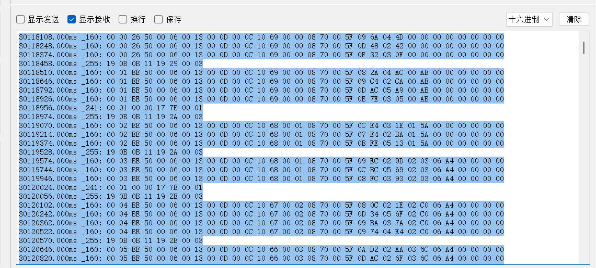
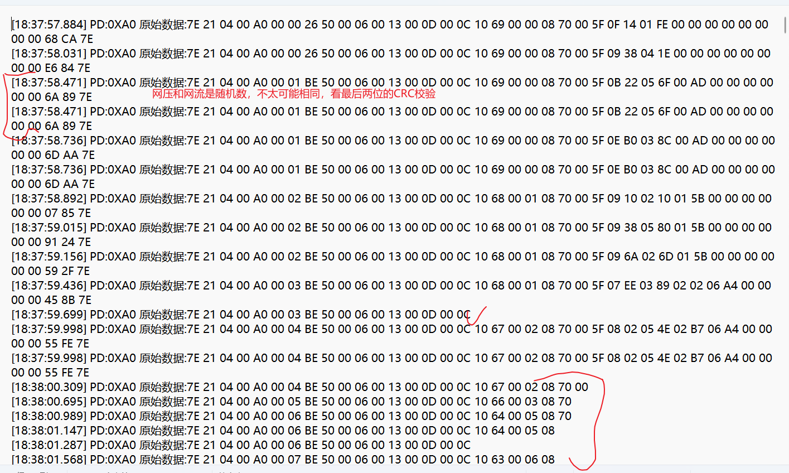

## 发送端帧截断下的逻辑

```txt
完整数据PPP帧:7e 21 size(1) PD(2) data CRC(2) 7e
截断情况下：
分段1：7e 21 size(1) PD(2) data_1 
分段2：data_2 CRC(2) 7e
```

接着通过程序发数据，通过MVB-Serial工具接收数据。查看情况如下：




我的log当中截取的部分如下：
```log
[2025-11-11 17:25:41.369] [FRAME] PD=0XA0 | 数据: 分段1/2: 7e 21 04 00 a0 00 00 26 50 00 06 00 13 00 0d 00 0c 10 69 00 00 08 70 00 5f | 发送: 25/25 字节
[2025-11-11 17:25:41.390] [FRAME] PD=---- | 数据: 分段2/2(续): 09 6a 04 4d 00 00 00 00 00 00 00 00 74 5c 7e | 发送: 15/15 字节
[2025-11-11 17:25:41.508] [FRAME] PD=0XA0 | 数据: 分段1/2: 7e 21 04 00 a0 00 00 26 50 00 06 00 13 00 0d 00 0c 10 69 00 00 08 70 | 发送: 23/23 字节
[2025-11-11 17:25:41.519] [FRAME] PD=---- | 数据: 分段2/2(续): 00 5f 0d 48 02 42 00 00 00 00 00 00 00 00 50 6e 7e | 发送: 17/17 字节
[2025-11-11 17:25:41.639] [FRAME] PD=0XA0 | 数据: 分段1/2: 7e 21 04 00 a0 00 00 26 50 00 06 00 13 00 0d 00 0c 10 69 00 00 08 70 00 5f | 发送: 25/25 字节
[2025-11-11 17:25:41.650] [FRAME] PD=---- | 数据: 分段2/2(续): 0f 32 03 0f 00 00 00 00 00 00 00 00 3f e2 7e | 发送: 15/15 字节
[2025-11-11 17:25:41.742] [FRAME] PD=0XFF | 数据: 7e 21 02 00 ff 19 0b 0b 11 19 29 00 03 8c 5d 7e | 发送: 16/16 字节
[2025-11-11 17:25:41.780] [FRAME] PD=0XA0 | 数据: 分段1/2: 7e 21 04 00 a0 00 01 be 50 00 06 00 13 00 0d 00 0c 10 69 00 00 | 发送: 21/21 字节
[2025-11-11 17:25:41.790] [FRAME] PD=---- | 数据: 分段2/2(续): 08 70 00 5f 08 2a 04 ac 00 ab 00 00 00 00 00 00 77 32 7e | 发送: 19/19 字节
[2025-11-11 17:25:41.922] [FRAME] PD=0XA0 | 数据: 分段1/2: 7e 21 04 00 a0 00 01 be 50 00 06 00 13 00 0d 00 0c 10 69 00 | 发送: 20/20 字节
[2025-11-11 17:25:41.935] [FRAME] PD=---- | 数据: 分段2/2(续): 00 08 70 00 5f 09 c4 02 ca 00 ab 00 00 00 00 00 00 fc 1e 7e | 发送: 20/20 字节
[2025-11-11 17:25:42.064] [FRAME] PD=0XA0 | 数据: 分段1/2: 7e 21 04 00 a0 00 01 be 50 00 06 00 13 00 0d 00 0c 10 69 00 00 08 | 发送: 22/22 字节
[2025-11-11 17:25:42.077] [FRAME] PD=---- | 数据: 分段2/2(续): 70 00 5f 0d ac 05 a9 00 ab 00 00 00 00 00 00 07 8b 7e | 发送: 18/18 字节
[2025-11-11 17:25:42.199] [FRAME] PD=0XA0 | 数据: 分段1/2: 7e 21 04 00 a0 00 01 be 50 00 06 00 13 00 0d 00 0c 10 69 00 00 08 70 00 5f | 发送: 25/25 字节
[2025-11-11 17:25:42.211] [FRAME] PD=---- | 数据: 分段2/2(续): 0e 7d 5e 03 05 00 ab 00 00 00 00 00 00 83 12 7e | 发送: 16/16 字节
[2025-11-11 17:25:42.247] [FRAME] PD=0XF1 | 数据: 7e 21 02 00 f1 00 01 00 00 17 7b 00 01 5f b1 7e | 发送: 16/16 字节
[2025-11-11 17:25:42.263] [FRAME] PD=0XFF | 数据: 7e 21 02 00 ff 19 0b 0b 11 19 2a 00 03 e8 b2 7e | 发送: 16/16 字节
```

结论：能够完全对应上，这说明帧截断的情况下发送的逻辑是正确的。

## 当前接收端存在的问题

### 数据帧没有截断的情况

1. 从发送-接收的角度(log-origindata的对比)，通过脚本分析，存在以下的现象：

```bash
python compare_data.py
```

```bash
正在解析日志文件: bin/Log/Y0.log
从日志文件中提取到 2874 帧数据
正在解析数据文件: dataY0/originData/2025-11-11\0XA0\data.txt
从 dataY0/originData/2025-11-11\0XA0\data.txt 中提取到 2005 帧数据
正在解析数据文件: dataY0/originData/2025-11-11\0XF1\data.txt
从 dataY0/originData/2025-11-11\0XF1\data.txt 中提取到 290 帧数据
正在解析数据文件: dataY0/originData/2025-11-11\0XFF\data.txt
从 dataY0/originData/2025-11-11\0XFF\data.txt 中提取到 579 帧数据
总共从数据文件中提取到 2874 帧数据

=== 比较 PD 类型 0XA0 ===
日志中有 2010 帧, 数据文件中有 2005 帧
匹配成功: 1999 帧
日志中未匹配: 11 帧
数据文件中未匹配: 6 帧

0XA0 类型在日志中未匹配的帧:==>如下的数据没有正常接收
  时间: 2025-11-11 18:30:26.251000, 数据长度: 80
  时间: 2025-11-11 18:31:59.169000, 数据长度: 80
  时间: 2025-11-11 18:33:09.130000, 数据长度: 80
  时间: 2025-11-11 18:33:14.025000, 数据长度: 80
  时间: 2025-11-11 18:33:14.161000, 数据长度: 80
  时间: 2025-11-11 18:33:39.087000, 数据长度: 80
  时间: 2025-11-11 18:34:18.301000, 数据长度: 80
  时间: 2025-11-11 18:34:31.327000, 数据长度: 80
  时间: 2025-11-11 18:35:02.201000, 数据长度: 80
  时间: 2025-11-11 18:35:15.636000, 数据长度: 80
  时间: 2025-11-11 18:35:20.760000, 数据长度: 80

0XA0 类型在数据文件中未匹配的帧:==>如下的数据接收是异常的(出现了数据7e data 7e 7e anoter_data 7e)
  时间: 18:33:09.181000, 数据长度: 112
  时间: 18:33:09.181000, 数据长度: 112
  时间: 18:33:14.175000, 数据长度: 160
  时间: 18:33:14.175000, 数据长度: 160
  时间: 18:33:39.181000, 数据长度: 112
  时间: 18:33:39.181000, 数据长度: 112

=== 比较 PD 类型 0XF1 ===
日志中有 288 帧, 数据文件中有 290 帧
匹配成功: 286 帧
日志中未匹配: 2 帧
数据文件中未匹配: 4 帧

0XF1 类型在日志中未匹配的帧:
  时间: 2025-11-11 18:30:25.706000, 数据长度: 32
  时间: 2025-11-11 18:30:26.749000, 数据长度: 32

0XF1 类型在数据文件中未匹配的帧:
  时间: 18:30:25.740000, 数据长度: 64
  时间: 18:30:25.740000, 数据长度: 64
  时间: 18:30:26.783000, 数据长度: 66
  时间: 18:30:26.783000, 数据长度: 66

=== 比较 PD 类型 0XFF ===
日志中有 576 帧, 数据文件中有 579 帧
匹配成功: 565 帧
日志中未匹配: 11 帧
数据文件中未匹配: 14 帧

0XFF 类型在日志中未匹配的帧:
  时间: 2025-11-11 18:30:25.722000, 数据长度: 32
  时间: 2025-11-11 18:30:26.238000, 数据长度: 34
  时间: 2025-11-11 18:30:26.766000, 数据长度: 34
  时间: 2025-11-11 18:31:59.646000, 数据长度: 32
  时间: 2025-11-11 18:33:09.755000, 数据长度: 32
  时间: 2025-11-11 18:33:39.673000, 数据长度: 32
  时间: 2025-11-11 18:34:18.849000, 数据长度: 32
  时间: 2025-11-11 18:34:31.702000, 数据长度: 32
  时间: 2025-11-11 18:35:02.694000, 数据长度: 32
  时间: 2025-11-11 18:35:15.610000, 数据长度: 32
  时间: 2025-11-11 18:35:20.736000, 数据长度: 32

0XFF 类型在数据文件中未匹配的帧:
  时间: 18:30:26.268000, 数据长度: 114
  时间: 18:30:26.268000, 数据长度: 114
  时间: 18:31:59.216000, 数据长度: 112
  时间: 18:31:59.216000, 数据长度: 112
  时间: 18:34:18.317000, 数据长度: 112
  时间: 18:34:18.317000, 数据长度: 112
  时间: 18:34:31.340000, 数据长度: 112
  时间: 18:34:31.340000, 数据长度: 112
  时间: 18:35:02.214000, 数据长度: 112
  时间: 18:35:02.214000, 数据长度: 112
  时间: 18:35:15.653000, 数据长度: 112
  时间: 18:35:15.653000, 数据长度: 112
  时间: 18:35:20.775000, 数据长度: 112
  时间: 18:35:20.775000, 数据长度: 112

=== 总结 ===
总匹配帧数: 2850
日志中未匹配帧数: 24
数据文件中未匹配帧数: 24
存在不匹配的帧，请检查以上详细信息。
```

2. 从发了什么数据-解析数据的角度(send.csv-parsedData,仅考虑0XA0)

```bash
python analyze_data_diff.py
```

```bash
Data.txt entries: 2005
CSV entries: 2010

发现 6063 处不匹配 (共比较 54135 个条目):
====================================================================================================
Index Time(data.txt)  Time(CSV)  Field                  data.txt   CSV       
----------------------------------------------------------------------------------------------------
10    66626.394       1.438      netElectric            2750       1073      
10    66626.394       1.438      netVoltage             786        254.0     
11    66626.520       1.558      netElectric            2930       786       
11    66626.520       1.558      netVoltage             1393       275.0     
12    66626.676       1.690      netElectric            2140       1393      
12    66626.676       1.690      netVoltage             571        293.0    
......
```

一部分原因是由于没有正确接收数据导致，还有一部分的原因是解析时机的问题。


### 数据帧截断的情况

接收端存在的问题在收到数据的时候，比如0XA0收到的原数据




## 发送端存在的2个问题

```txt
data1: "7E 21 04 00 A0 00 0B BE 50 00 06 00 13 00 0D 00 0C 10 59 00 10 08 70 00 5F 09 7D 5E 04 1F 07 BF 06 A4 00 00 00 00 90 C1 7E";
data2: "7E 21 04 00 A0 00 07 BE 50 00 06 00 13 00 0D 00 0C 10 63 00 06 08 70 00 5F 0C 1C 02 F2 04 CF 06 A4 00 00 00 00 7D 5D 03 7E"
```

测试:
```cpp
      {
        QStringList testData;
        testData << "7E 21 04 00 A0 00 0B BE 50 00 06 00 13 00 0D 00 0C 10 59 00 10 08 70 00 5F 09 92 03 24 07 BF 06 A4 00 00 00 00 6E FB 7E";
        testData << "7E 21 04 00 A0 00 0B BE 50 00 06 00 13 00 0D 00 0C 10 59 00 10 08 70 00 5F 09 7D 5E 04 1F 07 BF 06 A4 00 00 00 00 90 C1 7E";
        testData << "7E 21 04 00 A0 00 0B BE 50 00 06 00 13 00 0D 00 0C 10 59 00 10 08 70 00 5F 0C BC 02 DC 07 BF 06 A4 00 00 00 00 EE A9 7E";
        testData << "7E 21 04 00 A0 00 07 BE 50 00 06 00 13 00 0D 00 0C 10 63 00 06 08 70 00 5F 0C 1C 02 F2 04 CF 06 A4 00 00 00 00 7D 5D 03 7E";

        for (int i = 0; i < testData.size(); ++i) {
            // 将十六进制字符串转换为QByteArray
            QString hexData = testData[i];
            QByteArray rawData = QByteArray::fromHex(hexData.toLatin1());

            // 模拟完整的帧处理流程
            // 1. 提取PD号 (从frame而不是data)
            quint16 PD = MVB_Tool::getPD(rawData);

            // 2. 获取从帧长度类型 (使用frame而不是data)
            FramSizeType sizeType = MVB_Tool::getSlaveFramSizeType(rawData);

            // 3. 获取具体数据 (使用frame而不是data)
            QByteArray framData = MVB_Tool::getData(rawData, sizeType, PD);

            qDebug() << "解析第" << (i+1) << "条数据:";
            qDebug() << "PD:" << QString("0x%1").arg(PD, 0, 16).toUpper();
            qDebug() << "帧数据大小:" << framData.size();
            qDebug() << "帧数据内容:" << framData.toHex(' ');

            if(MVB_Tool::checkCRC(const_cast<QByteArray&>(rawData)))
                qDebug()<<"数据校验成功";
            // 解析运行信息
            RunInfoStruct runInfo;
            if (MVB_Tool::parseRunInfoFromBytes(framData, runInfo)) {
                QString raw = runInfo.toCsvRaw();
                qDebug() << "runinfo: " << raw;

                // 同时打印详细信息
                // runInfo.print();
            } else {
                qDebug() << "解析第" << (i+1) << "条数据失败";
                qDebug() << "期望数据大小: 32字节, 实际数据大小:" << framData.size();
            }
            qDebug() << "";
        }
    }
```

```bash
解析第 1 条数据:
PD: "2025-11-12 10:42:42 INFO ../../Com/httpserver.cpp:279 路由初始化成功
02025-11-12 10:42:42 INFO ../../Com/httpserver.cpp:91 HttpServer 启动：127.0.0.1:8000
XA0"
帧数据大小: 32
帧数据内容: "00 0b be 50 00 06 00 13 00 0d 00 0c10 59 00 10 08 70 00 5f 09 92 03 24 07 bf 06 a4 00 00 00 00"
数据校验成功
QString::arg: Argument missing: "11,6,19,13,12,4185,16,2160,95,2450,804,1983,1700,0,0,1,0,1,1,1,1,1,0,0,1,0,1" , 0
QString::arg: Argument missing: "11,6,19,13,12,4185,16,2160,95,2450,804,1983,1700,0,0,1,0,1,1,1,1,1,0,0,1,0,1" , 0
runinfo:  "11,6,19,13,12,4185,16,2160,95,2450,804,1983,1700,0,0,1,0,1,1,1,1,1,0,0,1,0,1"

解析第 2 条数据:
PD: "0XA0"
帧数据大小: 32
帧数据内容: "00 0b be 50 00 06 00 13 00 0d 00 0c 10 59 00 10 08 70 00 5f 09 7e 04 1f 07 bf 06 a4 00 00 00 00"
QString::arg: Argument missing: "11,6,19,13,12,4185,16,2160,95,2430,1055,1983,1700,0,0,1,0,1,1,1,1,1,0,0,1,0,1" , 0
QString::arg: Argument missing: "11,6,19,13,12,4185,16,2160,95,2430,1055,1983,1700,0,0,1,0,1,1,1,1,1,0,0,1,0,1" , 0
runinfo:  "11,6,19,13,12,4185,16,2160,95,2430,1055,1983,1700,0,0,1,0,1,1,1,1,1,0,0,1,0,1"

解析第 3 条数据:
PD: "0XA0"
帧数据大小: 32
帧数据内容: "00 0b be 50 00 06 00 13 00 0d 00 0c 10 59 00 10 08 70 00 5f 0c bc 02 dc 07 bf 06 a4 00 00 00 00"
数据校验成功
QString::arg: Argument missing: "11,6,19,13,12,4185,16,2160,95,3260,732,1983,1700,0,0,1,0,1,1,1,1,1,0,0,1,0,1" , 0
QString::arg: Argument missing: "11,6,19,13,12,4185,16,2160,95,3260,732,1983,1700,0,0,1,0,1,1,1,1,1,0,0,1,0,1" , 0
runinfo:  "11,6,19,13,12,4185,16,2160,95,3260,732,1983,1700,0,0,1,0,1,1,1,1,1,0,0,1,0,1"

解析第 4 条数据:
PD: "0XA0"
帧数据大小: 33
帧数据内容: "00 07 be 50 00 06 00 13 00 0d 00 0c 10 63 00 06 08 70 00 5f 0c 1c 02 f2 04 cf 06 a4 00 00 00 00 7d"
解析第 4 条数据失败
期望数据大小: 32字节, 实际数据大小: 33
```

- data1,data2校验失败，校验的时候没有进行转移处理。
- data2使用getData方法的时候，获取数据的大小 = 33。应该先对整个数据进行转义处理。


**checkCRC的修改**

```cpp
bool MVB_Tool::checkCRC(const QByteArray &data)
{
    if(data.size()<4)
    {
        return false;
    }

    // 创建一个副本用于转义处理
    QByteArray processedData = data;

    // 对数据进行反向转义处理，处理0x7D 0x5E和0x7D 0x5D的情况
    unescapeReceivedData(processedData);

    QByteArray packet;
    for(int i=1;i<processedData.size()-3;i++)
    {
        packet.append(processedData[i]);
    }

    QByteArray result = appendCrc16(packet);

    if(processedData[processedData.size()-3] == result[result.size()-2] && processedData[processedData.size()-2] == result[result.size()-1])
    {
        return true;
    }

    return false;
}
```

**getData的修改**

```cpp
QByteArray MVB_Tool::getData(QByteArray &data, FramSizeType sizeType,quint16 PD)
{
    // 保存帧数据的对象
    QByteArray framData;

    // 先对整个数据进行转义处理
    QByteArray processedData = data;
    unescapeReceivedData(processedData);

    // PD号为126和125时，分别为0x7E和0x7D，THCP会对其进行转义，所以在PD号为这两个的时候需要多读取一位PD
    if(PD!=126 && PD!=125)
    {
        // 帧中携带的数据大小是动态的，无法根据数据中携带的数据大小信息来判断，介于帧头和帧尾数据是固定位数，所以可以反推帧数据的大小
        for(int i=5;i<5+processedData.size()-8;i++)
        {
            // 添加到对象中保存
            framData.append(processedData[i]);
        }
    }
    else
    {
        // 帧中携带的数据大小是动态的，无法根据数据中携带的数据大小信息来判断，介于帧头和帧尾数据是固定位数，所以可以反推帧数据的大小
        for(int i=6;i<6+processedData.size()-9;i++)
        {
            // 添加到对象中保存
            framData.append(processedData[i]);
        }
    }

    return framData;
}
```

```bash
�第 1 条数据:
PD: "0XA0"
帧数据大小: 32
帧数据内容: "00 0b be 50 00 06 00 13 00 0d 00 0c 10 59 00 10 08 70 00 5f 09 92 03 24 07 bf 06 a4 00 00 00 00"
数据校验成功
QString::arg: Argument missing: "11,6,19,13,12,4185,16,2160,95,2450,804,1983,1700,0,0,1,0,1,1,1,1,1,0,0,1,0,1" , 0
QString::arg: Argument missing: "11,6,19,13,12,4185,16,2160,95,2450,804,1983,1700,0,0,1,0,1,1,1,1,1,0,0,1,0,1" , 0
runinfo:  "11,6,19,13,12,4185,16,2160,95,2450,804,1983,1700,0,0,1,0,1,1,1,1,1,0,0,1,0,1"

解析第 2 条数据:
PD: "0XA0"
帧数据大小: 32
帧数据内容: "00 0b be 50 00 06 00 13 00 0d 00 0c 10 59 00 10 08 70 00 5f 09 7e 04 1f 07 bf 06 a4 00 00 00 00"
数据校验成功
QString::arg: Argument missing: "11,6,19,13,12,4185,16,2160,95,2430,1055,1983,1700,0,0,1,0,1,1,1,1,1,0,0,1,0,1" , 0
QString::arg: Argument missing: "11,6,19,13,12,4185,16,2160,95,2430,1055,1983,1700,0,0,1,0,1,1,1,1,1,0,0,1,0,1" , 0
runinfo:  "11,6,19,13,12,4185,16,2160,95,2430,1055,1983,1700,0,0,1,0,1,1,1,1,1,0,0,1,0,1"

解析第 3 条数据:
PD: "0XA0"
帧数据大小: 32
帧数据内容: "00 0b be 50 00 06 00 13 00 0d 00 0c 10 59 00 10 08 70 00 5f 0c bc 02 dc 07 bf 06 a4 00 00 00 00"
数据校验成功
QString::arg: Argument missing: "11,6,19,13,12,4185,16,2160,95,3260,732,1983,1700,0,0,1,0,1,1,1,1,1,0,0,1,0,1" , 0
QString::arg: Argument missing: "11,6,19,13,12,4185,16,2160,95,3260,732,1983,1700,0,0,1,0,1,1,1,1,1,0,0,1,0,1" , 0
runinfo:  "11,6,19,13,12,4185,16,2160,95,3260,732,1983,1700,0,0,1,0,1,1,1,1,1,0,0,1,0,1"

解析第 4 条数据:
PD: "0XA0"
帧数据大小: 32
帧数据内容: "00 07 be 50 00 06 00 13 00 0d 00 0c 10 63 00 06 08 70 00 5f 0c 1c 02 f2 04 cf 06 a4 00 00 00 00"
数据校验成功
QString::arg: Argument missing: "7,6,19,13,12,4195,6,2160,95,3100,754,1231,1700,0,0,1,0,1,1,1,1,1,0,0,1,0,1" , 0
QString::arg: Argument missing: "7,6,19,13,12,4195,6,2160,95,3100,754,1231,1700,0,0,1,0,1,1,1,1,1,0,0,1,0,1" , 0
runinfo:  "7,6,19,13,12,4195,6,2160,95,3100,754,1231,1700,0,0,1,0,1,1,1,1,1,0,0,1,0,1"
```

## MVB_Tool::start()的修改

**分析：**

第1个发送数据：
data ={7e 21 04 00 a0 00 00 26 50 00 06 00 13 00 0d 00 0c 10 69 00 00 08 70}
incompleteFrame ={}
frameBuffer ={7e 21 04 00 a0 00 00 26 50 00 06 00 13 00 0d 00 0c 10 69 00 00 08 70}
headerIndex = 0;endIndex=-1;
incompleteFrame={7e 21 04 00 a0 00 00 26 50 00 06 00 13 00 0d 00 0c 10 69 00 00 08 70}
startIndex=0

第2个发送数据：
data ={00 5f 0c d0 04 a4 00 00 00 00 00 00 00 00 b1 2d 7e}
endIndex = 16;
completeFrame ={7e 21 04 00 a0 00 00 26 50 00 06 00 13 00 0d 00 0c 10 69 00 00 08 70 00 5f 0c d0 04 a4 00 00 00 00 00 00 00 00 b1 2d 7e}
incompleteFrame={}
第3个发送数据：

data ={7e 21 04 00 a0 00 00 26 50 00 06 00 13 00 0d 00 0c 10 69 00 00 08 70 00 5f 0e}
frameBuffer={7e 21 04 00 a0 00 00 26 50 00 06 00 13 00 0d 00 0c 10 69 00 00 08 70
			7e 21 04 00 a0 00 00 26 50 00 06 00 13 00 0d 00 0c 10 69 00 00 08 70 00 5f 0e}
headerIndex=0;endIndex=23;
frame ={7e 21 04 00 a0 00 00 26 50 00 06 00 13 00 0d 00 0c 10 69 00 00 08 70 7e}

因此这部分，“如果没找到帧尾，说明可能是分割帧的第一部分”，frameBuffer.clear()会比较好。

**当然，如果第1个数据的第一段，需要等待接下来的好几个数据段，才能找到第1个数据的第二段的情况，我还没考虑。**


```cpp
void MVB_Tool::start()
{
    // 打开串口
    if (serial->open(QIODevice::ReadOnly)) {
        log_info("串口打开成功：%s",serial->portName().toStdString().c_str());
    } else {
        log_info("无法打开串口：%s",serial->errorString().toStdString().c_str());
        return;
    }

    // 使用 Lambda 连接 readyRead 信号
    QObject::connect(serial, &QSerialPort::readyRead, [this]() {
        // 读取串口接收到的数据
        QByteArray data = serial->readAll();
        // qDebug() << "收到原始数据：" << data.toHex(' ') << "原始数据长度:" << data.size();

        // 1. 如果有未完成的帧，先尝试重组
        if (!incompleteFrame.isEmpty()) {
            // 查找新数据中的0x7E（可能是分割帧第二部分的结尾）
            int endIndex = data.indexOf(0x7E);
            if (endIndex != -1) {
                // 找到0x7E，说明这是分割帧的第二部分
                // 重组完整帧：incompleteFrame + data的前endIndex+1字节
                QByteArray completeFrame = incompleteFrame;
                completeFrame.append(data.left(endIndex + 1));
                incompleteFrame.clear();

                // 处理重组后的完整帧
                processCompleteFrame(completeFrame);

                // 将剩余数据添加到frameBuffer继续处理
                if (endIndex + 1 < data.size()) {
                    data = data.mid(endIndex + 1);
                } else {
                    // 没有剩余数据，返回
                    return;
                }
            } else {
                // 如果新数据中没有0x7E，可能是继续的分割数据，追加到未完成帧
                incompleteFrame.append(data);

                // 防止缓冲区无限增长
                if (incompleteFrame.size() > 1024) {
                    qWarning() << "未完成帧缓冲区过大，可能通信异常，清空" << incompleteFrame.size();
                    incompleteFrame.clear();
                }
                // 没有剩余数据，返回
                return;
            }
        }

        // 2. 累积新数据
        frameBuffer.append(data);

        // 3. 查找所有完整的 7E ... 7E 帧
        int startIndex = 0;
        while (startIndex < frameBuffer.size()) {
            // 查找下一个 0x7E（帧头）
            int headerIndex = frameBuffer.indexOf(0x7E, startIndex);
            if (headerIndex == -1) {
                break;
            }

            // 从帧头开始，查找下一个 0x7E（帧尾）
            int endIndex = -1;
            for (int i = headerIndex + 1; i < frameBuffer.size(); ++i) {
                if (frameBuffer[i] == 0x7E) {
                    endIndex = i;
                    break;
                }
            }

            // 如果没找到帧尾，说明可能是分割帧的第一部分
            if (endIndex == -1) {
                // 检查是否可能是分割帧的第一部分（有帧头但没有帧尾）
                // 保存未完成的部分到 incompleteFrame
                incompleteFrame = frameBuffer.mid(headerIndex);
                // frameBuffer.remove(0, headerIndex);
                frameBuffer.clear();
                break; // 跳出，等待下次数据
            }

            // 提取完整帧
            QByteArray frame = frameBuffer.mid(headerIndex, endIndex - headerIndex + 1);
            // qDebug() << "收到完整原始数据：" << frame.toHex(' ');

            processCompleteFrame(frame);

            // 4. 更新 startIndex，继续查找后续帧（处理粘包）
            startIndex = endIndex + 1;
        }

        // 5. 清理已处理的数据（从 0 到 startIndex）
        if (startIndex > 0) {
            frameBuffer.remove(0, startIndex);
        }

        // 可选：防止缓冲区无限增长
        if (frameBuffer.size() > 1024) {
            qWarning() << "缓冲区过大，可能通信异常，清空" << frameBuffer.size();
            frameBuffer.clear();
        }

    });
}

void MVB_Tool::processCompleteFrame(const QByteArray &frame)
{
    // 检查帧格式：必须以0x7E开头和结尾
    if (frame.size() < 3 || static_cast<quint8>(frame[0]) != 0x7E || static_cast<quint8>(frame[frame.size() - 1]) != 0x7E) {
        qWarning() << "无效的帧格式";
        return;
    }

    // 获取PD号（使用frame而不是data）
    quint16 PD = MVB_Tool::getPD(const_cast<QByteArray&>(frame));

    // 如果没在需要监听的PD列表里面,则不执行后面的代码
    if(!isInPDList(PD))
    {
        return;
    }

    QDateTime timestamp = QDateTime::currentDateTime();

    // 获取从帧长度类型（使用frame而不是data）
    FramSizeType sizeType = MVB_Tool::getSlaveFramSizeType(const_cast<QByteArray&>(frame));
    // qDebug()<<"从帧长度类型:" << sizeType;

    // 获取具体数据（使用frame而不是data）
    QByteArray framData = MVB_Tool::getData(const_cast<QByteArray&>(frame), sizeType, PD);
    if (frame.size()>40)
        qDebug()<<"数据:" << framData.toHex(' ')<< "size = "<<framData.size();

    // 进行CRC16校验（使用frame而不是data）
    if(MVB_Tool::checkCRC(const_cast<QByteArray&>(frame)))
    {
        // 开始解析
        MVB_Tool::startResolve(PD, framData);
        // 发送解析信号
        this->emitParsedSignals(PD);
    }

    emit rawDataReceived(timestamp, PD, frame);
}

// .h增加参数：QByteArray incompleteFrame;  // 保存未完成的帧（分割帧的第一部分）
// .h的public方法添加：void processCompleteFrame(const QByteArray &frame);// 处理完整帧
```

通过脚本，从发送-接收的角度(log-origindata的对比)和分析发了什么数据-解析数据的角度(send.csv-parsedData,仅考虑0XA0)。
这时候需要增加一个考虑帧截断下的log-origindata的对比的脚本。


**数据帧没有被截断情况下：**
```bash
(base) PS D:\PROJECT\MVB_Com\MVB-SEND-DEMO\mvb_send_demo> python .\compare_data.py --log bin/Log/XX0.log --data-dir .\dataXX0\originData\2025-11-12\
正在解析日志文件: bin/Log/XX0.log
从日志文件中提取到 2687 帧数据
正在解析数据文件: .\dataXX0\originData\2025-11-12\0XA0\data.txt
从 .\dataXX0\originData\2025-11-12\0XA0\data.txt 中提取到 1866 帧数据
正在解析数据文件: .\dataXX0\originData\2025-11-12\0XF1\data.txt
从 .\dataXX0\originData\2025-11-12\0XF1\data.txt 中提取到 274 帧数据
正在解析数据文件: .\dataXX0\originData\2025-11-12\0XFF\data.txt
从 .\dataXX0\originData\2025-11-12\0XFF\data.txt 中提取到 547 帧数据
总共从数据文件中提取到 2687 帧数据

=== 比较 PD 类型 0XA0 ===
日志中有 1866 帧, 数据文件中有 1866 帧
匹配成功: 1866 帧
日志中未匹配: 0 帧
数据文件中未匹配: 0 帧

=== 比较 PD 类型 0XF1 ===
日志中有 274 帧, 数据文件中有 274 帧
匹配成功: 274 帧
日志中未匹配: 0 帧
数据文件中未匹配: 0 帧

=== 比较 PD 类型 0XFF ===
日志中有 547 帧, 数据文件中有 547 帧
匹配成功: 547 帧
日志中未匹配: 0 帧
数据文件中未匹配: 0 帧

=== 总结 ===
总匹配帧数: 2687
日志中未匹配帧数: 0
数据文件中未匹配帧数: 0
恭喜！所有字段都匹配。
(base) PS D:\PROJECT\MVB_Com\MVB-SEND-DEMO\mvb_send_demo> python .\analyze_data_diff.py
Data.txt entries: 1866
CSV entries: 1866

恭喜！所有字段都匹配。
```

**数据帧截断的情况下：**
```bash
(base) PS D:\PROJECT\MVB_Com\MVB-SEND-DEMO\mvb_send_demo> python .\compare_fragmented_data.py
正在解析日志文件: bin/Log/XX1.log
从日志文件中提取到 2445 帧数据
正在解析数据文件: dataXX1/originData/2025-11-12\0XA0\data.txt
从 dataXX1/originData/2025-11-12\0XA0\data.txt 中提取到 1568 帧数据
正在解析数据文件: dataXX1/originData/2025-11-12\0XF1\data.txt
从 dataXX1/originData/2025-11-12\0XF1\data.txt 中提取到 293 帧数据
正在解析数据文件: dataXX1/originData/2025-11-12\0XFF\data.txt
从 dataXX1/originData/2025-11-12\0XFF\data.txt 中提取到 584 帧数据
总共从数据文件中提取到 2445 帧数据

=== 比较 PD 类型 0XA0 ===
日志中有 1568 帧, 数据文件中有 1568 帧
匹配成功: 1568 帧
日志中未匹配: 0 帧
数据文件中未匹配: 0 帧

=== 比较 PD 类型 0XF1 ===
日志中有 293 帧, 数据文件中有 293 帧
匹配成功: 293 帧
日志中未匹配: 0 帧
数据文件中未匹配: 0 帧

=== 比较 PD 类型 0XFF ===
日志中有 584 帧, 数据文件中有 584 帧
匹配成功: 584 帧
日志中未匹配: 0 帧
数据文件中未匹配: 0 帧

=== 总结 ===
总匹配帧数: 2445
日志中未匹配帧数: 0
数据文件中未匹配帧数: 0
恭喜！所有字段都匹配。
(base) PS D:\PROJECT\MVB_Com\MVB-SEND-DEMO\mvb_send_demo> python .\analyze_data_diff.py
Data.txt entries: 1568
CSV entries: 1568

恭喜！所有字段都匹配。
```